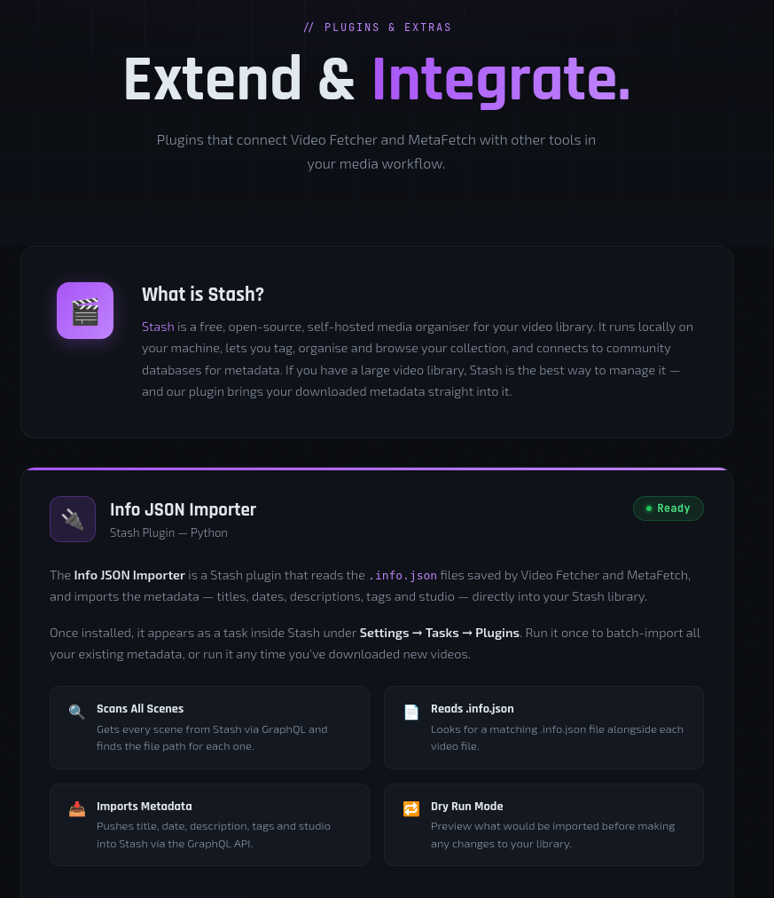

  

<h1 align="center">StashDB Info JSON Importer</h1>

  

  <strong>Free Stash plugin — imports .info.json metadata into your Stash media library</strong>

  <a href="https://videofetcher.co.uk/plugins.html">⬇️ Download</a> ·
  <a href="https://videofetcher.co.uk">🌐 Website</a>

---

## What Is This Plugin?

The StashDB Info JSON Importer is a free plugin for [Stash](https://stashapp.cc/) that reads `.info.json` sidecar files generated by yt-dlp and imports the metadata directly into your Stash scene library.

---

## What It Imports

- Title
- Date
- Description
- Tags
- Studio / Uploader
- Scene metadata

---

## Requirements

- [Stash](https://stashapp.cc/) media manager installed and running
- `.info.json` files alongside your video files (generated by yt-dlp or MetaFetch)
- Videos already scanned into your Stash library

---

## Installation

1. Download `infoJsonImporter.zip` from [videofetcher.co.uk/plugins.html](https://videofetcher.co.uk/plugins.html)
2. In Stash, go to **Settings → Plugins**
3. Click **Install Plugin from file**
4. Select the downloaded zip
5. The plugin will appear in your plugin list

---

## Usage

1. Ensure your videos are scanned into Stash
2. Ensure `.info.json` files exist alongside the video files
3. Go to **Plugins → StashDB Info JSON Importer**
4. Run the importer
5. Metadata is populated for each matched scene

---

## Companion Apps

### Video Fetcher 2026
Batch video downloader that saves `.info.json` metadata automatically alongside each download.
👉 **[videofetcher.co.uk](https://videofetcher.co.uk)**

### MetaFetch (Free)
Fetches missing `.info.json` files for existing video libraries — without re-downloading videos.
👉 **[videofetcher.co.uk/metafetch.html](https://videofetcher.co.uk/metafetch.html)**

---

## Links

- 🌐 **Website:** [videofetcher.co.uk](https://videofetcher.co.uk)
- ⬇️ **Plugin download:** [videofetcher.co.uk/plugins.html](https://videofetcher.co.uk/plugins.html)
- ☕ **Support:** [videofetcher.co.uk/support.html](https://videofetcher.co.uk/support.html)
- 📧 **Contact:** [david@videofetcher.co.uk](mailto:david@videofetcher.co.uk)

---

  <strong>StashDB Info JSON Importer</strong> 
  © 2026 David Smith · <a href="https://videofetcher.co.uk">videofetcher.co.uk</a> 
  <a href="mailto:david@videofetcher.co.uk">david@videofetcher.co.uk</a>

